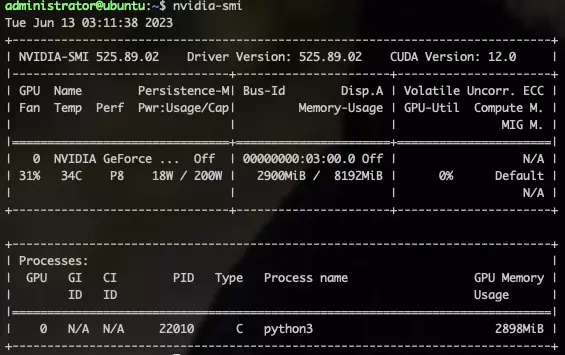

Nividia GPU Monitoring Commands


This command monitors your GPU:

```bash
$ nvidia-smi
```

This tool is similar to the above command except for the information displayed in detail:

```bash
$ nvidia-smi -a
```

Below cmd monitors your GPU every second, refreshing and tracking the output itself for each second:

```bash
$ watch –n 1 -d nvidia-smi
```

To list all available NVIDIA devices, run:

```bash
$ nvidia-smi -L
# Below is an example output
GPU 0: NVIDIA GeForce RTX 3060 Ti (UUID: GPU-fa3da260-9c42-828f-981a-f6d7b48d77b3)
```

To list certain details about each GPU, try:

```bash
$ nvidia-smi --query-gpu=index,name,uuid,serial --format=csv
index, name, uuid, serial
0, NVIDIA GeForce RTX 3060 Ti, GPU-fa3da260-9c42-828f-981a-f6d7b48d77b3, [N/A]
```

To monitor overall GPU usage with 1-second update intervals:

```bash
$ nvidia-smi dmon
# gpu   pwr gtemp mtemp    sm   mem   enc   dec  mclk  pclk
# Idx     W     C     C     %     %     %     %   MHz   MHz
    0     19     41      -     0      0      0      0    405    210
    0     19     41      -     0      0      0      0    405    210
    0     19     41      -     0      0      0      0    405    210
```

To monitor per-process GPU usage with 1-second update intervals:

```bash
$ nvidia-smi pmon
# gpu        pid  type    sm   mem   enc   dec   command
# Idx          #   C/G     %     %     %     %   name
    0      22010     C    98    56     -     -   python3
    0      22010     C    98    56     -     -   python3
    0      22010     C    98    55     -     -   python3
```


Some terminologies:





Two tables are generated as the output where first reflects the information about all available GPUs (above example states 1 GPU). The second table tells you about the processes using GPUs. Let’s dig into it more.

**Temp:** Core GPU temperature is in degrees Celsius. We need not worry about it since it will be controlled by DBM datacentres except to care about your hardware. The above “44C” in the table shown is normal but give a call when it reaches 90+ C.

**Perf:** Denotes GPU’s current performance state. It ranges from P0 to P12 referring to maximum and minimum performance respectively.

**Persistence-M:** The value of the Persistence Mode flag where “On” means that the NVIDIA driver will remain loaded(persist) even when no active client such as Nvidia-smi is running. This reduces the driver load latency with dependent apps such as CUDA programs.

**Pwr:** Usage/Cap: It refers to the GPU’s current power usage out of total power capacity. It samples in Watts.

**Bus-Id:** GPU’s PCI bus id as “domain:bus:device.function”, in hex format which is used to filter out the stats of a particular device.

**Disp.A:** Display Active is a flag that decides if you want to allocate memory on a GPU device for display i.e. to initialize the display on GPU. Here, “Off” indicates that there isn’t any display using a GPU device.

**Memory-Usage:** Denotes the memory allocation on GPU out of total memory. Tensorflow or Keras(TensorFlow backend) automatically allocates whole memory when getting launched, even though it doesn’t require it.

**Volatile Uncorr. ECC:** ECC stands for Error Correction Code which verifies data transmission by locating and correcting transmission errors. NVIDIA GPUs provide an error count of ECC errors. Here, the Volatile error counter detects the error count since the last driver loaded.

**GPU-Util:** It indicates the percent of GPU utilization i.e. percent of the time when kernels were using GPU over the sample period.

**Compute M.:** Compute Mode of specific GPU refers to the shared access mode where compute mode sets to default after each reboot. The “Default” value allows multiple clients to access the CPU at the same time.

**GPU:** Indicates the GPU index, beneficial for multi-GPU setup. This determines which process is utilizing which GPU. This index represents the NVML Index of the device.

**PID:** Refers to the process by its ID using GPU.

**Type:** Refers to the type of processes such as “C” (Compute), “G” (Graphics), and “C+G” (Compute and Graphics context).

**Process Name:** Self-explanatory

**GPU Memory Usage:** Memory of specific GPU utilized by each process.

Other metrics and detailed descriptions are stated on Nvidia-smi manual page.


References:

- Database Mart [Database Mart](https://portal.databasemart.com/kb/a2221/monitor-gpu-utilization-with-nvidia-smi.aspx)


